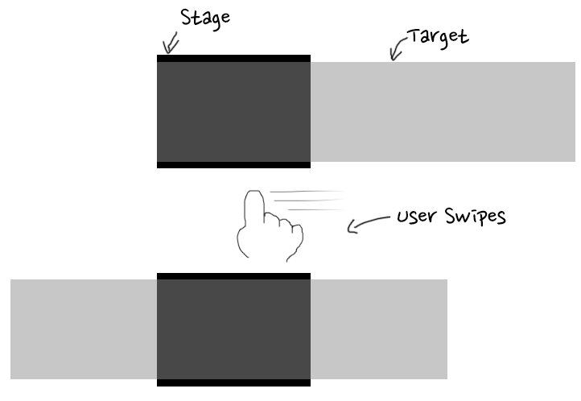

# Infinite Swipe 

Infinite Swipe is simple swipe library that can use for both desktop and mobile
devices.

How it works
------------

Place target at stage that shows UI. If target has N pages, target should be
N times than stage.

    bower install infinite-swipe

Very simple example
-------------------

Load `swipe.min.js`, `swipe.min.css` first.
Please note that the jQuery library include before `swipe.min.js`.

    <link rel="stylesheet" href="path/to/swipe.min.css">
    
    

Prepare HTML codes like belows.
You can specify your own class name than `stage` or `target`.

    

      <ul class="target">
        <li></li>
        <li></li>
        <li></li>
      </ul>
    

Defines the initial state of stage and target in CSS codes.

    ul, li { /* reset for default ui, li selector */
      margin: 0;
      padding: 0;
      list-style: none;
    }
    .stage {
      width: 300px;
      height: 300px;
      overflow: hidden;
    }
    .target {
      width: 900px;
    }
    .target li {
      float: left;
    }

Run swipe function via javascript code.

    $('.stage').infiniteSwipe({
      $target: $('.target'),
      total: 3 // total 3 pages
    });

Check the results with above codes? You can check swipe function with touch
devices. If you uses no touch devices(with mouse, and so on), check
prev, next buttons example instead.

[Run very simple example](http://jsfiddle.net/r4o574ax/1/)

Infinite Swipe
--------------

With `infinite` option, you can create an infinite swipe.

    $('.stage').infiniteSwipe({
      $target: $('.target'),
      total: 3,
      infinite: true
    });

[Infinite Swipe Demo](http://jsfiddle.net/5ghbg1j3/1/)

Prev, Next Buttons
------------------

Add markup used to prev / next buttons and specify that with the jQuery element,
each `$prev`, `$next` option, you can make previous, next button functions.

    

      <ul class="target">
        <li></li>
        <li></li>
        <li></li>
      </ul>
      

      

    

Add `$prev`, `$next` options to javascript codes.

    $('.stage').infiniteSwipe({
      $target: $('.target'),
      total: 3,
      $prev: $('.prev'),
      $next: $('.next')
    });

The following is a sample CSS code for Prev, Next buttons.
If you do not specify an infinite option, the class `disabled` is added to
the prev button at first page, and the next page button at last page.

    .prev{cursor:pointer;position:absolute;top:350px;left:100px;width:47px;height:25px;background:url(http://mctenshi.github.io/infinite-swipe/images/prev.png) no-repeat 0 0;}
    .prev.disabled{cursor:default;opacity:.3}
    .next{cursor:pointer;position:absolute;top:350px;right:100px;width:47px;height:25px;background:url(http://mctenshi.github.io/infinite-swipe/images/next.png) no-repeat 0 0;}
    .next.disabled{cursor:default;opacity:.3}

[Prev, Next Buttons Demo](http://jsfiddle.net/ebk03jzz/1/)

With `infinite` option, prev, next buttons also works as infinite swipe.

    $('.stage').infiniteSwipe({
      $target: $('.target'),
      total: 3,
      $prev: $('.prev'),
      $next: $('.next'),
      infinite: true
    });

[Prev, Next Buttons + infinite option Demo](http://jsfiddle.net/h03k7368/2/)

Show current page
------------------

When you add markup to display the current page number and
specify the jQuery Element as `$curr` options, you can make the element
as the current page indicator.

    

      <ul class="target">
        <li></li>
        <li></li>
        <li></li>
      </ul>
      

      

        <strong class="curr">1</strong>
        /
        3
      

      

    

Add `$curr` option to javascript codes.

    $('.stage').infiniteSwipe({
      $target: $('.target'),
      total: 3,
      $prev: $('.prev'),
      $next: $('.next'),
      $curr: $('.curr')
    });

Below is CSS code example for current page.

    .pages {position:absolute;top:350px;left:100px;width:100px;text-align:center;}
    .curr {color:red}

[Prev, Next Buttons + current page option Demo](http://jsfiddle.net/1dj6yyun/)

Responsive Swipe
----------------

Infinite swipe basically support responsive design!

check [Responsive swipe example](https://mctenshi.github.io/infinite-swipe/sample/responsive.html).

Options
-------

Options for Infinite Swipe.

 * `$target`: (Required) set content element as jQuery element.
 * `total`: (Required) Set total page count.
 * `$prev`: set previous button as jQuery Element.
 * `$next`: set next button as jQuery Element.
 * `infinite`: set boolean to use infinite scroll or not. (default: false)
 * `$curr`: set element to display current page number as jQuery Element.
 * `transition_ms`: set swipe transition speed as milliseconds. (default: 300)
 * `onPage`: event that fires when page changed. Pass page number with
     first argument.

Methods
-------

`swipe_total`: change total page count

    $('.stage').trigger('swipe_total', 5);

`swipe_page`: change current page. ignore if presented page is
larger then total page count.

    $('.stage').trigger('swipe_page', 1);

Live Example
------------

 * Shinsegae duty free shop "RECOMMEND PRODUCT": http://www.ssgdfs.com/shop/main
 * Korean woman clothing mall Naingirl "You may also like":
http://www.naingirl.com/shop/shopdetail.html?branduid=96849
